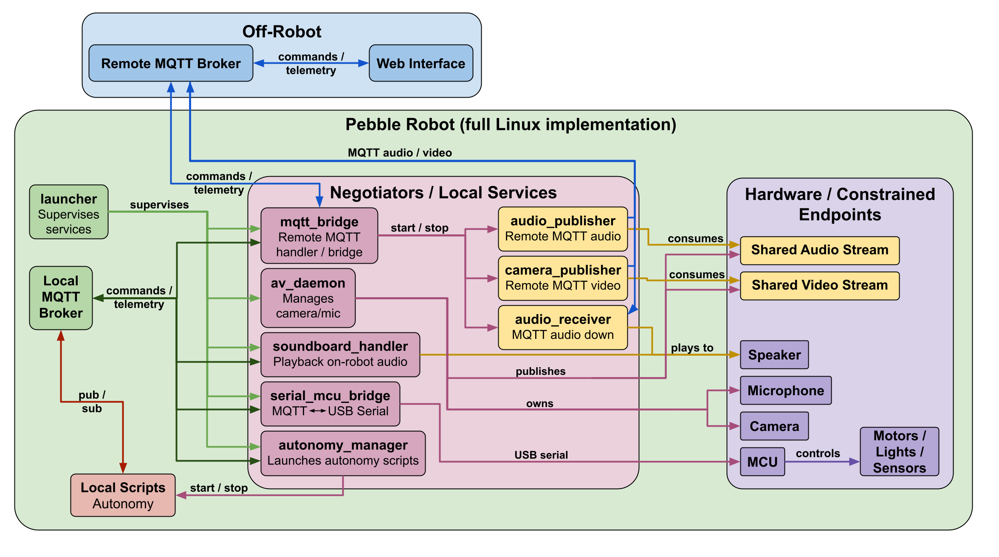

# Pebble

Pebble is a local-first MQTT communication stack for distributed components.



## Included Reference Platforms

These platform directories are preserved as repository examples:
- Goob
- Fred
- MiniLAMP (Seeed XIAO ESP32-C6 firmware)
- BUMPERBOT

## Repository Layout

- `control/` - local runtime services (`launcher`, `av_daemon`, `mqtt_bridge`, `serial_mcu_bridge`, `soundboard_handler`, `autonomy_manager`)
- `web-interface/` - web UI service and Docker runtime files
- `autonomy/apriltag-follow/` - AprilTag/autonomy utilities
- `audio/` - MQTT audio publisher/receiver scripts
- `video/` - MQTT video publisher scripts
- `soundboard/` - soundboard MQTT contract and usage docs
- `firmware/` - MCU firmware
- `mqtt_standard.md` - topic and payload standard

## MQTT Topic Format

Pebble uses the topic format documented in `mqtt_standard.md`:

- `{system}/{type}/{id}/{incoming|outgoing}/{metric}`

Infrastructure discovery remains reserved at:

- `{system}/infrastructure`

## Setup (Example Linux Robot)

This section is an example bring-up path for a Linux-hosted robot with:
- Raspberry Pi (or similar Linux host)
- serial-connected MCU
- camera/microphone (optional but expected for MQTT media)

### 1. Install OS packages

```bash
sudo apt update
sudo apt install -y \
  git \
  mosquitto mosquitto-clients \
  python3 python3-pip python3-venv \
  python3-serial python3-paho-mqtt python3-flask python3-opencv python3-numpy \
  gstreamer1.0-tools gstreamer1.0-plugins-base gstreamer1.0-plugins-good gstreamer1.0-plugins-bad \
  gstreamer1.0-alsa \
  alsa-utils \
  v4l-utils
```

If `control/configs/config.json` sets `services.av_daemon.video.backend` to
`libcamera`, also install your distro's libcamera GStreamer plugin package
(for example on Raspberry Pi OS/Debian variants):

```bash
sudo apt install -y gstreamer1.0-libcamera libcamera-tools
gst-inspect-1.0 libcamerasrc
```

### 2. Enable local MQTT broker

```bash
sudo systemctl enable --now mosquitto
sudo systemctl status mosquitto --no-pager
```

### 3. Clone and configure Pebble

Use any install path; `/opt/pebble` is only the systemd example default:

```bash
git clone <your-repo-url> <repo-path>
cd <repo-path>
cp control/configs/config.json.example control/configs/config.json
```

Edit `control/configs/config.json` for this robot:
- robot identity (`robot.system`, `robot.type`, `robot.id`)
- `services.mqtt_bridge.remote_mqtt.*`
- serial port (`services.serial_mcu_bridge.serial.port`)
- serial safety controls (`services.serial_mcu_bridge.safety.*`)
- any camera/audio backend/device settings for `services.av_daemon`

If you enable reboot control (`services.mqtt_bridge.reboot_control.command` uses `sudo`),
add this in `sudo visudo` so reboot can run without a password prompt:

```text
username ALL=(root) NOPASSWD: /sbin/reboot
```

If you enable remote git-pull control (`services.mqtt_bridge.git_pull_control.command`),
ensure the runtime service user can run `git pull` in `/opt/pebble` without prompts
(repo ownership + non-interactive auth keys/tokens as needed).

`control/configs/config.json` is gitignored and should stay local to the robot.

### 4. Configure firmware private credentials (MiniLAMP only)

```bash
cp firmware/MINILAMP_seeed-xiao-c6/private_config.h.example \
  firmware/MINILAMP_seeed-xiao-c6/private_config.h
```

Fill in private values in `private_config.h`. This file is gitignored.

### 5. Grant runtime device access

Replace `pebble` with the Linux account that runs the service. This account
needs serial, audio, and video access:

```bash
sudo usermod -aG dialout pebble
sudo usermod -aG audio pebble
sudo usermod -aG video pebble
```

Log out and back in (or reboot) so the new group membership applies.

### 6. Select camera/microphone devices

Discover stable camera device nodes:

```bash
ls /dev/v4l/by-id/
v4l2-ctl --device=/dev/video0 --list-formats-ext
v4l2-ctl --device=/dev/video1 --list-formats-ext
```

For Logitech C922 specifically, use the stable `...video-index0` path for
capture and `capture_format: "mjpeg"` for high-resolution/high-fps modes.
For libcamera-based CSI camera setups, use `services.av_daemon.video.backend`
as `libcamera` (or alias `arducam`) and set
`services.av_daemon.video.camera_controls` as needed.
If the camera is exposed as V4L2 (like `/dev/video0` with `v4l2-ctl` formats),
you can instead set `services.av_daemon.video.backend` to `v4l2` and set
`services.av_daemon.video.device` to that node. If V4L2 allocation fails on
CSI cameras, use `libcamera`/`arducam` backend.

Discover capture/playback audio devices:

```bash
arecord -l
aplay -l
```

If needed, set a system-wide ALSA default playback card:

```bash
sudo tee /etc/asound.conf >/dev/null <<'EOF'
defaults.pcm.card 3
defaults.pcm.device 0
defaults.ctl.card 3
EOF
```

### 7. First manual launch (recommended before systemd)

```bash
cd <repo-path>
python3 control/launcher.py --config control/configs/config.json
```

If this starts cleanly, stop it with `Ctrl+C` and continue with systemd.

### 8. Install systemd service

```bash
sudo cp systemd/pebble-control.service.example /etc/systemd/system/pebble-control.service
sudo nano /etc/systemd/system/pebble-control.service
```

Update at least:
- `User`
- `Group` (optional; remove this line if you do not use a dedicated group)
- `WorkingDirectory`
- `ExecStart`

Then enable it:

```bash
sudo systemctl daemon-reload
sudo systemctl enable --now pebble-control.service
```

### 9. Validate service health

```bash
systemctl status pebble-control.service --no-pager
journalctl -u pebble-control.service -f
```

You can also sanity-check live MQTT traffic:

```bash
mosquitto_sub -h 127.0.0.1 -t 'pebble/#' -v
```

Then run the on-robot smoke test:

```bash
python3 tests/on_robot_smoke.py --config control/configs/config.json
```

After reboot/systemd validation:

```bash
python3 tests/on_robot_smoke.py --config control/configs/config.json --no-launch
```

If remote broker access is intentionally unavailable, run local-only validation:

```bash
python3 tests/on_robot_smoke.py --config control/configs/config.json --no-launch --skip-remote
```

## Web Interface

Run from repo root:

```bash
python3 web-interface/web-control.py
```

Web interface MQTT/robot defaults now come from `control/configs/config.json`
under the `web_interface` section.
For a dedicated web-only config file, set `PEBBLE_CONFIG` when starting
`web-control.py`.
Robots can also self-advertise features through retained
`.../outgoing/capabilities`, enabling dynamic UI capability discovery.
When capability + heartbeat telemetry is present, `web_interface.robots` can stay empty.
The UI includes soundboard and autonomy panels; autonomy start/stop publishes to
`.../incoming/autonomy-command` using scripts/config fields reported on
`.../outgoing/autonomy-files`.
If `web_interface.mqtt_history.enabled=true`, the UI can also persist all MQTT
message history to MongoDB (`pymongo` dependency).

## Future Work

- Expand `tests/` with deeper subsystem + integration coverage:
  - `mqtt_bridge` routing/flags/loop-prevention
  - `serial_mcu_bridge` command and telemetry behavior
  - `soundboard_handler` command/files/status behavior
  - `av_daemon` lifecycle behavior
  - end-to-end local/remote broker scenarios
- Extend structured `{system}/{type}/{id}/outgoing/logs` diagnostics:
  - Include richer service metadata and optional media-source unavailability annotations.
- Evaluate replacing current delta-frame MQTT video payload with a more efficient encoded video transport.
- Standardize robot-wide soundboard event cues for scripts:
  - Define stable cue names (for example `error`, `warning`, `info`, `success`) mapped to consistent sounds.
  - Add helper utilities so autonomy/control scripts can publish soundboard commands with a shared contract.
- Add audio volume control integration:
  - Extend the system audio script(s) so the web interface can adjust playback/capture volume via ALSA mixer commands (for example `amixer`).
  - Expose bounded volume controls in the web UI and publish/apply updates safely on-robot.
- Add soundboard repeat playback modes:
  - Support a repeat toggle that loops a selected sound until a manual stop command is received.
  - Support timed repeat (for example "repeat for X seconds") for alert and status cues.

## Troubleshooting

- `WARNING: erroneous pipeline: no element "alsasrc"`:
  install `gstreamer1.0-alsa`.
- `WARNING: erroneous pipeline: no element "jpegparse"`:
  install `gstreamer1.0-plugins-bad`.
- `WARNING: erroneous pipeline: no element "libcamerasrc"`:
  install `gstreamer1.0-libcamera libcamera-tools`, then verify with
  `gst-inspect-1.0 libcamerasrc`.
- `Failed to allocate required memory` from `v4l2src`:
  set `services.av_daemon.video.capture_format` explicitly (for example `yuyv`)
  and try `services.av_daemon.video.io_mode: "rw"`.
- `arecord: ... no soundcards found` while `/proc/asound/cards` shows devices:
  ensure the runtime user is in `audio` group and re-login/reboot.
- Webcam node confusion:
  use `/dev/v4l/by-id/...video-index0` as the capture device for C922.
- If `arecord` capture requires stereo on C922:
  use `channels: 2` in `services.av_daemon.audio` and
  `services.mqtt_bridge.media.audio_publisher`.
- Video/audio stream shows "connecting" forever:
  ensure `.../incoming/flags/mqtt-video` / `.../incoming/flags/mqtt-audio`
  are `true` (retained). The web UI start actions set these automatically.
- `front-camera control payload missing boolean`:
  publish a boolean payload (`true`/`false`) or JSON with `value`/`enabled`
  (for example `{"value": true}`), not string commands like `"start"`.
- Robot keeps driving after control loss:
  tune `services.serial_mcu_bridge.safety.drive_timeout_seconds`
  (default `0.75`) and keep `ignore_retained_drive: true`.
